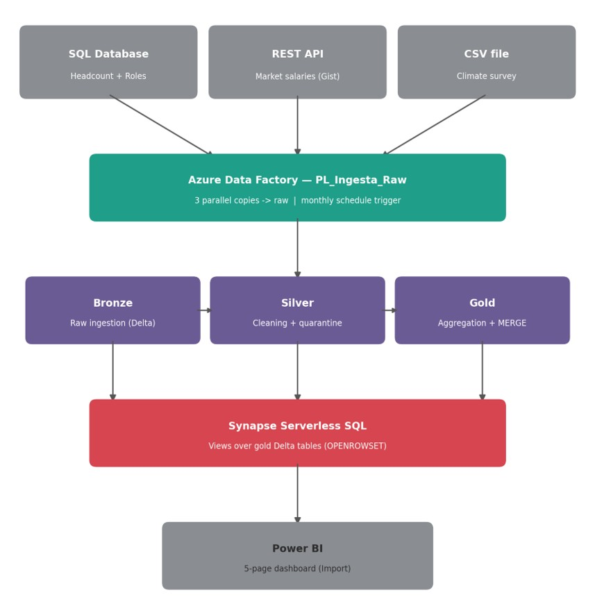
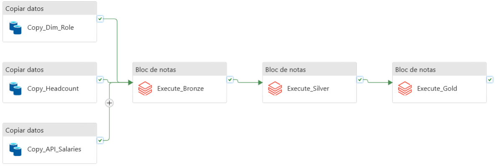

# People Analytics — Flight Risk, Compensation Equity & Workforce Dynamics


An end-to-end Azure data platform that turns three disconnected HR data sources into a single source of truth for one question: **which employees are at risk of leaving, and why?**

Built on a Medallion architecture (Bronze/Silver/Gold), orchestrated by Azure Data Factory, transformed in Databricks (PySpark), served through Synapse Serverless SQL, and consumed in a 5-page Power BI dashboard.

**[→ View the live Power BI dashboard](https://app.powerbi.com/view?r=eyJrIjoiOGM1NTcwODUtODhmMi00NmI1LWExOTItZjRmZGQ1NTc0NmYxIiwidCI6IjhhYWI3M2EwLTQ5MTgtNGM3NS05Zjg1LTU5MzVjNDMxOTBmYSIsImMiOjR9&embedImagePlaceholder=true)**

---

## Table of Contents

- [The Business Problem](#the-business-problem)
- [Architecture](#architecture)
- [Data Sources](#data-sources)
- [Transformations](#transformations)
- [Data Quality Framework](#data-quality-framework)
- [Orchestration & Automation](#orchestration--automation)
- [Engineering Challenges](#engineering-challenges)
- [The Dashboard](#the-dashboard)
- [Key Insight](#key-insight)
- [Tech Stack](#tech-stack)
- [Repository Structure](#repository-structure)
- [Scalability & Roadmap](#scalability--roadmap)
- [A Note on the Data](#a-note-on-the-data)

---

## The Business Problem

Retention risk, pay equity, and workforce dynamics usually live in three different systems — a payroll database, an HR platform, and a spreadsheet somewhere. Answering "who's at risk of leaving, and why" means stitching all three together by hand, every time.

This project builds that answer once, automatically, every month: a pipeline that ingests headcount, market compensation data, and employee sentiment from three heterogeneous sources, resolves them into a clean analytical layer, and surfaces the result in a dashboard built for non-technical HR stakeholders — not just engineers.

## Architecture





*Three Copy Data activities run in parallel, then hand off to a sequential Bronze → Silver → Gold chain of Databricks notebook activities.*

| Zone | Purpose |
|---|---|
| **raw** | Landing zone. Files land exactly as received from the three sources — no transformation. |
| **bronze** | First conversion to Delta Lake, with ingestion metadata, loaded incrementally (append). |
| **silver** | Cleaned layer — corrected types, normalized text, and an explicit split between valid records and quarantined ones. |
| **gold** | Business-ready layer — two aggregated Delta tables, served to Power BI through Synapse. |

**Notable design decisions:**

- **Date parametrization over system time.** The pipeline receives `TargetDate` as a parameter rather than reading the system clock, so the same pipeline can replay historical months or run out-of-schedule without breaking file naming — a deliberate choice to make the pipeline reusable rather than a one-off script.
- **MERGE over overwrite in Gold.** Overwrite rewrites the entire table on every run — unsustainable as history grows. Gold uses an upsert (`MERGE`) keyed on `employee_id + snapshot_date + year`, updating only what changed.
- **Synapse views authenticated via Managed Identity.** No credentials stored in the SQL layer — the external data source uses the workspace's own managed identity.
- **UTF-8 collation in Synapse** (`Latin1_General_100_BIN2_UTF8`) to avoid mangled accented characters reaching Power BI.

## Data Sources

| Source | Type | Content | Ingestion |
|---|---|---|---|
| Azure SQL Database | Relational DB | Headcount + role structure | Copy Data activity, credentials via Key Vault |
| REST API | Simulated REST endpoint | Market compensation bands by role/month | Copy Data activity, anonymous auth |
| CSV file | Flat file | Semi-annual employee climate survey | Manual landing to `raw` |

All three land in parallel — there's no dependency between them — and only the Bronze notebook waits on all three finishing.

## Transformations

Implemented across Silver and Gold, all in PySpark notebooks:

- **Joins** — Headcount ↔ Roles ↔ Market Salaries ↔ Climate Survey.
- **LOCF (Last Observation Carried Forward)** — the survey only runs twice a year; each employee's satisfaction score is forward-filled from their last real response using a partitioned window function.
- **Derived metrics** — tenure in months, compa-ratio (actual salary ÷ market salary), and a flight-risk category (Low/Medium/High) combining compa-ratio and satisfaction.
- **Department-level aggregation** — headcount, hires, terminations, payroll, average compa-ratio, average satisfaction, and turnover rate, grouped by department and month.
- **Format conversion** — every layer persists as Delta Lake (from CSV/JSON), enabling ACID transactions, versioning, and efficient reads from Synapse.

```python
df_gold_snapshot = df_gold_snapshot.withColumn(
    "flight_risk_category",
    when(
        (col("compa_ratio") < 0.85) & (col("satisfaction_score") <= 3),
        lit("High")
    )
    .when(
        (col("compa_ratio") < 0.85) | (col("satisfaction_score") <= 3),
        lit("Medium")
    )
    .otherwise(lit("Low"))
)
```

Full notebooks: [`notebooks/`](notebooks/).

## Data Quality Framework

To stress-test the pipeline realistically, the synthetic generator deliberately injects data quality issues at controlled rates — inconsistent text formatting, out-of-range values, missing required fields — the kinds of problems a real HR data source produces. The Silver layer is what has to catch them.

**Validation rules:**
- **Intrinsic checks** — salary ≤ 0, missing required IDs, termination date before hire date, missing hire date.
- **Referential integrity** — role must exist in the roles dimension for that period; survey respondent must exist in that period's headcount.
- **Handling** — invalid rows are never silently dropped. They're routed to dedicated quarantine tables with an `error_reason` column, preserving a full audit trail for the source system owners to review and correct upstream.

**Audit results, 43 months of history:**

| Table | Valid | Quarantined | % quarantined |
|---|---|---|---|
| Dim Role | 1,290 | 0 | 0.0% |
| Headcount | 71,088 | 7,696 | 9.8% |
| Reference Salaries | 1,290 | 0 | 0.0% |
| Climate Survey | 9,444 | 1,053 | 10.0% |

## Orchestration & Automation

A Schedule trigger fires the pipeline on the 1st of every month at 03:00. The `TargetDate` pipeline parameter propagates to both the file names produced by the Copy activities and the Bronze notebook, so the whole run stays anchored to the same month end-to-end.

## Engineering Challenges

A few problems that came up building this, and how they got resolved:

| Problem | Root cause | Fix |
|---|---|---|
| 63% of `compa_ratio` values corrupted on export | Locale mismatch on decimal export turned `1,0604` into the integer `10604` | Explicit `DoubleType` casting instead of relying on inferred types |
| Same employee showed different gender/hire date depending on which script generated the row | Two generation scripts drew random attributes in a different order — same seed, different sequence of calls | Aligned the draw order between both scripts |
| Terminations artificially piled up on the last day of the observation window | Dates beyond the window were clamped to the boundary instead of treated as right-censored | Treated out-of-window dates as "still active" (no termination date) instead of forcing a value |
| Delta append failures on some monthly loads | A month where `termination_date` was 100% null caused Spark to infer a different type than the existing table | Explicit `StructType` schema on read, instead of `inferSchema` |
| ADF → Databricks job submission failing with a permissions error | Newer Databricks personal access tokens ship scope-restricted by default | Regenerated the token with the `jobs` scope explicitly included |
| Intermittent SQL connection timeouts from ADF | Azure SQL Serverless auto-pauses on inactivity; first connection has to wait for wake-up | Retry policy (3 attempts, 30s apart) on the affected Copy activities |

## The Dashboard

Five pages, each building on the last, all answering the same underlying question:

- **Executive Summary** — headcount, turnover, payroll, compa-ratio, satisfaction, and % high-risk at a glance.
- **Workforce Dynamics** — hires vs. terminations, turnover trend, seniority composition, average tenure.
- **Compensation** — payroll over time, average salary and compa-ratio by department against a market reference line, role-level detail.
- **Gender Equity** — representation and pay gap by department and gender.
- **Culture & Flight Risk** — satisfaction trend, survey participation, and a compa-ratio vs. satisfaction scatter colored by the flight-risk category computed in Gold.

Filters for date, department, and role stay synced across all five pages. Gender is the one exception — it's switched off on the Gender Equity page, since filtering by gender on a page built to compare genders defeats its own purpose.

**[→ Open the dashboard](https://app.powerbi.com/view?r=eyJrIjoiOGM1NTcwODUtODhmMi00NmI1LWExOTItZjRmZGQ1NTc0NmYxIiwidCI6IjhhYWI3M2EwLTQ5MTgtNGM3NS05Zjg1LTU5MzVjNDMxOTBmYSIsImMiOjR9&embedImagePlaceholder=true)**

## Key Insight

The most interesting finding didn't come from the pay-gap numbers — the gap between male and female average salary is negligible (~0.3%). It came from representation: female headcount share drops sharply at the top of the org chart, reaching **0% at the C-level**, while the gender split stays fairly even at every level below Director.

The equity problem this data surfaces isn't pay. It's who gets promoted.

## Tech Stack

`Azure Data Factory` · `Azure Databricks (PySpark)` · `Delta Lake` · `Azure SQL Database` · `Azure Blob Storage (hierarchical namespace)` · `Azure Synapse Analytics (Serverless SQL)` · `Power BI` · `Python` (data generation) · `GitHub Gist` (simulated REST API)

## Repository Structure

```
.
├── README.md
├── notebooks/
│   ├── 01_bronze_ingestion.ipynb
│   ├── 02_silver_cleaning.ipynb
│   └── 03_gold_modeling.ipynb
├── sql/
│   └── synapse_views.sql
├── data-generation/
│   ├── generate_historical_data.py
│   ├── generate_monthly_data.py
│   └── upload_to_sql.py
└── docs/
    └── architecture-diagram.png
```

## Scalability & Roadmap

- **Import → DirectQuery.** Power BI currently connects in Import mode — a practical call while the compute layer runs on trial credits, since Import decouples the dashboard from cluster uptime. On stable infrastructure, DirectQuery would be the natural next step: no duplicated history inside the model, always reflecting the latest state in Synapse.
- **Automate the CSV ingestion** with a Self-Hosted Integration Runtime, removing the one remaining manual step in the pipeline.
- **Role-level Gold table**, mirroring the department-level one, to push more aggregation into the data layer and lighten the DAX layer in Power BI.
- **Time-bounded event generation.** The synthetic generator anchors hire/termination dates to a fixed reference date — a known limitation being addressed to keep the monthly simulation showing organic hires and departures indefinitely.

## A Note on the Data

This project runs on a synthetic dataset ([Python + Faker](data_generation/)), not real employee records — the pipeline, the architecture, and the analysis are real; the people in it aren't. Department sizes, role hierarchy, salary bands, and the gender-representation pattern were deliberately modeled to resemble a real mid-size company, specifically so the resulting analysis wouldn't be trivial or flat.

---

*Built by Facundo Arnaudo — [[LinkedIn]](https://www.linkedin.com/in/facundo-arnaudo-19b1a0106) · [[Portfolio]](https://github.com/facundoarnaudo)*
